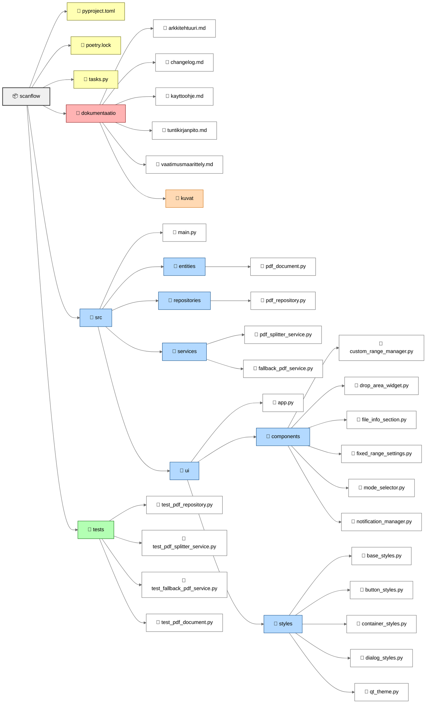
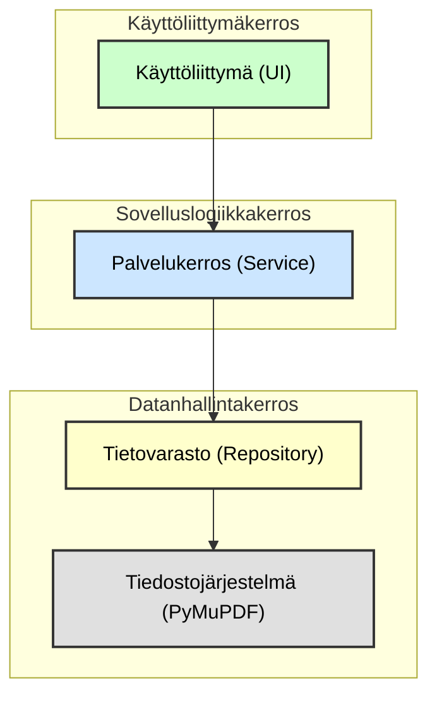
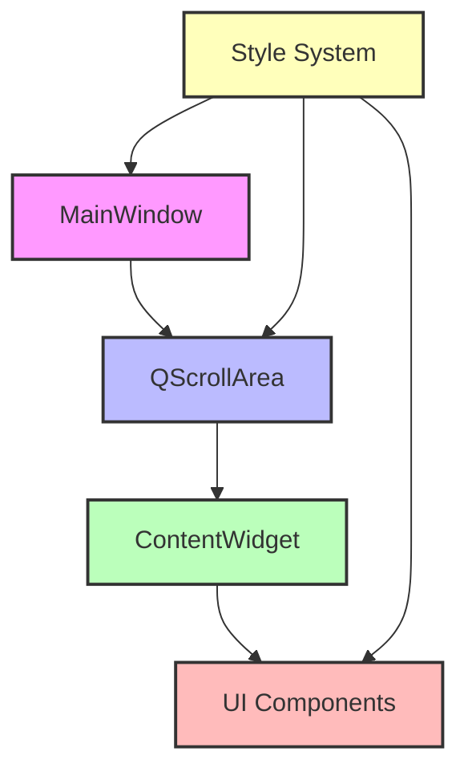

# Arkkitehtuuri

Tämä dokumentti kuvaa Scanflow-sovelluksen arkkitehtuurin korkean tason rakennetta ja sovelluslogiikkaa. Sovellus tarjoaa graafisen käyttöliittymän PDF-tiedostojen jakamiseen kiinteiden tai mukautettujen sivuvälien mukaan. Sovelluksessa on selkeä jako käyttöliittymän, sovelluslogiikan, tiedon käsittelyn ja tietorakenteiden välillä.

## Rakenne

Sovelluksen rakenne perustuu kerrosarkkitehtuuriin ja on jaettu loogisiin paketteihin seuraavasti:


**Selitys:**

* **`scanflow/`**: Projektin juurihakemisto.
    * **`src/`**: Sisältää sovelluksen lähdekoodin.
        * **`entities/`**: Määrittelee sovelluksen käyttämät tietorakenteet, kuten `PDFDocument`. (Huom: Koodissa `PDFDocument` ei ole keskeisessä roolissa tiedonvälityksessä kerrosten välillä.)
        * **`repositories/`**: Vastaa datan pysyväistallennuksesta ja hakemisesta. `PDFRepository` hoitaa PDF-tiedostojen lukemisen levyltä ja uusien PDF-tiedostojen tallentamisen käyttäen PyMuPDF (`fitz`) -kirjastoa.
        * **`services/`**: Sisältää sovelluksen ydinlogiikan. `PDFSplitterService` orkestroi PDF:n jakamisen kutsumalla `PDFRepository`:n metodeja. `FallbackPDFService` tarjoaa varatoiminnallisuuden.
        * **`ui/`**: Sisältää kaiken graafiseen käyttöliittymään (PyQt6) liittyvän koodin.
            * **`components/`**: Uudelleenkäytettävät käyttöliittymäkomponentit.
            * **`styles/`**: Käyttöliittymän ulkoasuun liittyvät tyylimäärittelyt (base_styles.py, button_styles.py, container_styles.py, dialog_styles.py, qt_theme.py).
            * **`app.py`**: Sovelluksen pääikkuna (`MainWindow`) ja taustasäie (`Worker`) PDF-käsittelylle.
        * **`main.py`**: Sovelluksen käynnistyspiste. Alustaa ja käynnistää sovelluksen.
    * **`dokumentaatio/`**: Projektin dokumentaatio.
    * **`tests/`**: Yksikkötestit.
    * **`tasks.py`**: Invoke-tehtävät.
    * Muut tiedostot (esim. `pyproject.toml`).

**Puurakenne:**
```tree
📦 scanflow
├── 📄 poetry.lock
├── 📄 pyproject.toml
├── 📄 tasks.py
├── 📁 dokumentaatio
│   ├── 📄 arkkitehtuuri.md
│   ├── 📄 changelog.md
│   ├── 📄 kayttoohje.md
│   ├── 📄 tuntikirjanpito.md
│   ├── 📄 vaatimusmaarittely.md
│   └── 📁 kuvat
├── 📁 src
│   ├── 📄 main.py
│   ├── 📁 entities
│   │   └── 📄 pdf_document.py
│   ├── 📁 repositories
│   │   └── 📄 pdf_repository.py
│   ├── 📁 services
│   │   ├── 📄 pdf_splitter_service.py
│   │   └── 📄 fallback_pdf_service.py
│   └── 📁 ui
│       ├── 📄 app.py
│       ├── 📁 components
│       │   ├── 📄 custom_range_manager.py
│       │   ├── 📄 drop_area_widget.py
│       │   ├── 📄 file_info_section.py
│       │   ├── 📄 fixed_range_settings.py
│       │   ├── 📄 mode_selector.py
│       │   └── 📄 notification_manager.py
│       └── 📁 styles
│           ├── 📄 base_styles.py
│           ├── 📄 button_styles.py
│           ├── 📄 container_styles.py
│           ├── 📄 dialog_styles.py
│           └── 📄 qt_theme.py
└── 📁 tests
    ├── 📄 test_pdf_repository.py
    ├── 📄 test_pdf_splitter_service.py
    ├── 📄 test_fallback_pdf_service.py
    ├── 📄 test_pdf_document.py
```
---

## Kerrosarkkitehtuuri

Sovellus noudattaa kerrosarkkitehtuuria, jossa vastuut on jaettu selkeästi eri kerroksiin:

**Selitys:**

1.  **Käyttöliittymä (UI)**: `src/ui/`-hakemiston komponentit, erityisesti `MainWindow` (`app.py`), vastaavat käyttäjän syötteiden vastaanottamisesta ja tulosten esittämisestä. Käyttöliittymä ei sisällä varsinaista PDF:n käsittelylogiikkaa. Raskaat PDF-operaatiot suoritetaan `Worker`-luokassa omassa `QThread`-säikeessä, jotta käyttöliittymä pysyy responsiivisena.
2.  **Palvelukerros (Service)**: `src/services/pdf_splitter_service.py` sisältää sovelluksen ydinlogiikan. `PDFSplitterService` ottaa vastaan pyyntöjä (toteutetaan `Worker`-säikeessä) ja käyttää `PDFRepository`:a tiedostojen käsittelyyn.
3.  **Tietovarasto (Repository)**: `src/repositories/pdf_repository.py` vastaa kaikesta suorasta vuorovaikutuksesta tiedostojärjestelmän ja PDF-kirjaston (PyMuPDF/`fitz`) kanssa.

---

## Sovelluksen kulku

1.  Käyttäjä käynnistää sovelluksen (`poetry run invoke start`).
2.  `main.py` alustaa lokituksen, valitsee `PDFSplitterService`- tai `FallbackPDFService`-toteutuksen, luo `MainWindow`-olion (injektoiden PDF-palvelun) ja käynnistää Qt-sovellussilmukan.
3.  Käyttäjä pudottaa PDF-tiedoston `DropAreaWidget`-alueelle tai valitsee sen manuaalisesti.
4.  `MainWindow` vastaanottaa tiedostopolun ja kutsuu `pdf_service.get_pdf_info()` hakemaan tiedot (käyttäen `PDFRepository`:a).
5.  `MainWindow` päivittää käyttöliittymän näyttämään tiedoston tiedot (`FileInfoSection`) ja aktivoi jakamisasetukset.
6.  Käyttäjä valitsee jakamistilan (`ModeSelectorGroup`) ja määrittää asetukset (`FixedRangeSettings` tai `CustomRangeManager`). Käyttäjä valitsee myös tallennuskansion.
7.  Käyttäjä painaa "Jaa PDF" -painiketta.
8.  `MainWindow` luo `Worker`-olion ja siirtää sen uuteen `QThread`-säikeeseen. `Worker` saa tarvittavat tiedot (PDF-palvelu, tiedostopolku, asetukset, jne.).
9.  `Worker`-säie käynnistyy ja kutsuu `pdf_service`-olion `split_by_fixed_range()` tai `split_by_custom_ranges()` -metodia.
10. `PDFSplitterService` käyttää `PDFRepository`:a PDF:n avaamiseen, sivujen poimimiseen ja uusien PDF-tiedostojen tallentamiseen.
11. `Worker` lähettää `progress`-signaaleja `MainWindow`:lle, joka päivittää `QProgressBar`:ta.
12. Kun jako on valmis, `Worker` lähettää `finished`-signaalin (sisältäen luotujen tiedostojen polut) tai `error`-signaalin `MainWindow`:lle.
13. `MainWindow` vastaanottaa signaalin, lopettaa `Worker`-säikeen, päivittää käyttöliittymän (`NotificationManager` näyttää ilmoituksen) ja aktivoi käyttöliittymäkomponentit uudelleen.

---

## Keskeiset luokat ja vastuut

| Luokka                 | Sijainti                           | Vastuu                                                                                                 |
| :--------------------- | :--------------------------------- | :----------------------------------------------------------------------------------------------------- |
| **main** | `src/main.py`                      | Sovelluksen käynnistys, palvelun alustus, pääikkunan luonti, globaali virheidenkäsittely.               |
| **MainWindow** | `src/ui/app.py`                    | Sovelluksen pääikkuna, UI-elementtien hallinta, käyttäjäinteraktioiden käsittely, Workerin käynnistys. Mukautuu näytön kokoon ja tarjoaa vieritysmahdollisuuden pienillä resoluutioilla.  |
| **Worker** | `src/ui/app.py`                    | Suorittaa PDF-jaon taustasäikeessä, kommunikoi MainWindow:n kanssa signaalien kautta.                 |
| **PDFSplitterService** | `services/pdf_splitter_service.py` | PDF:n jakamisen ydinlogiikka (kiinteä/mukautettu), käyttää PDFRepository:a.                           |
| **FallbackPDFService** | `services/fallback_pdf_service.py` | Tarjoaa PDFSplitterService-rajapinnan, jos PyMuPDF/fitz ei ole saatavilla (simuloi toimintaa).       |
| **PDFRepository** | `repositories/pdf_repository.py`   | PDF-tiedostojen matalan tason käsittely (lataus, sivujen poiminta, tallennus) PyMuPDF/fitz-kirjastolla. |
| **PDFDocument** | `entities/pdf_document.py`         | Yksinkertainen datarakenne PDF-tiedon esittämiseen (vähemmän keskeinen nykyisessä toteutuksessa).        |
| **DropAreaWidget** | `ui/components/drop_area_widget.py`| Tiedoston pudotus- ja valinta-alueen UI-komponentti.                                                  |
| **FileInfoSection** | `ui/components/file_info_section.py` | Näyttää valitun PDF-tiedoston perustiedot (nimi, sivumäärä).                                        |
| **ModeSelectorGroup** | `ui/components/mode_selector.py`   | Jakotavan valinnan (kiinteä/mukautettu) UI-komponentti.                                              |
| **FixedRangeSettings** | `ui/components/fixed_range_settings.py` | Kiinteän sivumääräjaon asetusten UI-komponentti.                                                      |
| **CustomRangeManager** | `ui/components/custom_range_manager.py` | Mukautettujen sivualueiden hallinnan UI-komponentti.                                                |
| **NotificationManager**| `ui/components/notification_manager.py` | Käyttäjälle näytettävien ilmoitusten (info, success, error) hallinta.                                |

---

## Keskeiset toiminnallisuudet

### Käyttöliittymän mukautuvuus

Sovellus mukautuu käytettävissä olevaan näytön tilaan:

1. Oletuskoko on 650x860 pikseliä, mutta ikkunan minimikoko on 500x500 pikseliä mahdollistaen käytön pienemmillä näytöillä.
2. Käynnistyessään sovellus tarkistaa näytön koon:
   - Jos näyttö on oletuskokoa pienempi, ikkuna skaalataan pienemmäksi 
   - Jos näyttö on riittävän suuri, käytetään oletuskokoa
3. Kaikki sisältö on kääritty vieritettävään alueeseen `QScrollArea`:
   - Vieritys aktivoituu automaattisesti, kun sisältö ei mahdu näkyviin
   - Pääikkunan vierityspalkki on piilossa
4. Tyylimäärittelyt:
   - Globaalit tyylit määritellään QtTheme-luokassa `src/ui/styles/qt_theme.py`
   - Komponenttikohtaiset tyylit löytyvät `styles/`-hakemistosta. Globaalit tyylit ovat `qt_theme.py`:ssä ja perustyylit `base_styles.py`:ssä.

### Käyttöliittymän arkkitehtuuri



Mukautuvan käyttöliittymän keskeiset luokat ja vastuut:

| Komponentti | Vastuu |
|------------|---------|
| MainWindow | Ikkunan koon hallinta, näytön koon tunnistus |
| QScrollArea | Vieritettävän sisällön hallinta |
| ContentWidget | Sisällön asettelu ja marginaalit |
| QtTheme | Globaalit tyylimäärittelyt, väripaletti |
| Styles-moduulit | Komponenttikohtaiset tyylit |

Tyylit otetaan käyttöön komponenteissa tyypillisesti importtaamalla tarvittava tyylimoduuli ja käyttämällä sen tarjoamia metodeja (esim. `apply_styles` tai `get_button_style`) komponentin alustuksen yhteydessä tai tarpeen mukaan.

Käyttöliittymän mukautuvuuden toteutus noudattaa seuraavia periaatteita:
- Responsiivinen suunnittelu: UI mukautuu näytön kokoon
- Progressive enhancement: Perustoiminnallisuus toimii pienilläkin näytöillä
- Yhtenäinen tyylimäärittely: Tyylit keskitetty `styles/`-hakemistoon
- Käytettävyys: Vierityspalkit näkyvät vain tarvittaessa

---

## Vastuut ja suunnittelumallit

* **Kerrosarkkitehtuuri (Layered Architecture)**: Jakaa sovelluksen UI-, palvelu- ja datanhallintakerroksiin, mikä parantaa modulaarisuutta ja ylläpidettävyyttä.
* **Repository-suunnittelumalli**: `PDFRepository` abstrahoi PDF-tiedostojen käsittelyn (`fitz`-kirjaston käytön) palvelukerrokselta. Tämä helpottaa testausta (mockaus) ja mahdollistaa PDF-kirjaston vaihtamisen ilman suurta vaikutusta muuhun sovellukseen.
* **Dependency Injection (Riippuvuuksien injektointi)**: `main.py` luo PDF-palveluolion ja injektoi sen `MainWindow`:lle. Tämä vähentää kytkentöjä ja parantaa `MainWindow`:n testattavuutta.
* **Taustasäie (Background Thread / Worker Pattern)**: Aikaavievä PDF-jako suoritetaan `Worker`-luokassa erillisessä `QThread`-säikeessä. Tämä pitää käyttöliittymän responsiivisena. Kommunikointi pääsäikeeseen tapahtuu Qt:n signaali-slot-mekanismilla (`progress`, `finished`, `error`).
* **Fallback Strategy**: `FallbackPDFService` tarjoaa vaihtoehtoisen, yksinkertaistetun toteutuksen, jos vaadittua `fitz`-kirjastoa ei ole asennettu, varmistaen sovelluksen jonkinasteisen toiminnan.

Nämä mallit edistävät sovelluksen **laajennettavuutta** ja **testattavuutta**.

---

## Periaatteet

* Sovellus noudattaa kerrosarkkitehtuuria.
* Käyttöliittymä on eriytetty sovelluslogiikasta ja tiedon käsittelystä.
* Koodi pyrkii olemaan helposti laajennettavissa ja testattavissa.
* PDF:n käsittelylogiikka ei ole sidottu käyttöliittymäkomponentteihin.
* Käyttöliittymän responsiivisuus varmistetaan ajamalla pitkäkestoiset operaatiot taustasäikeessä.