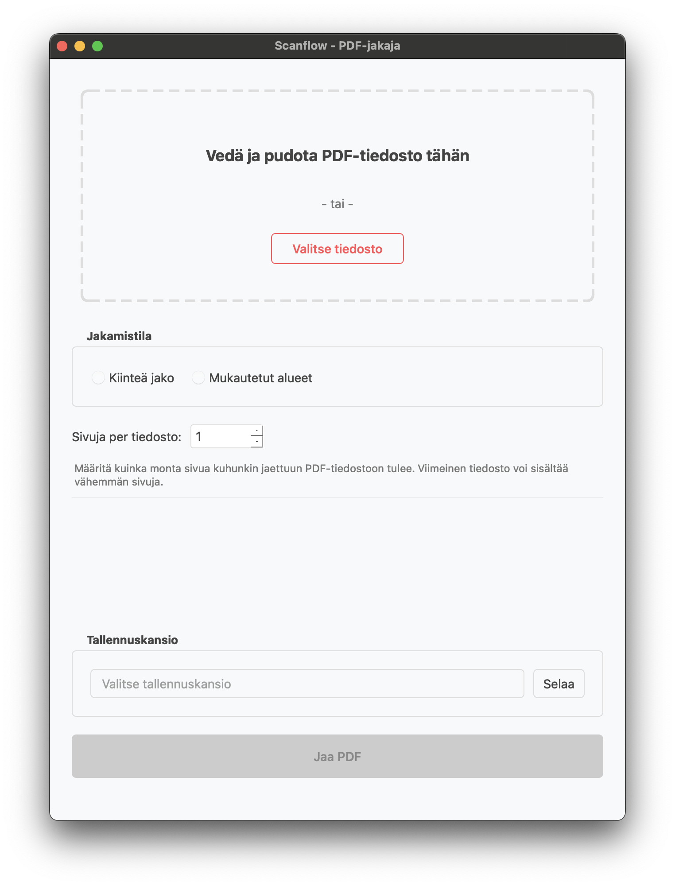
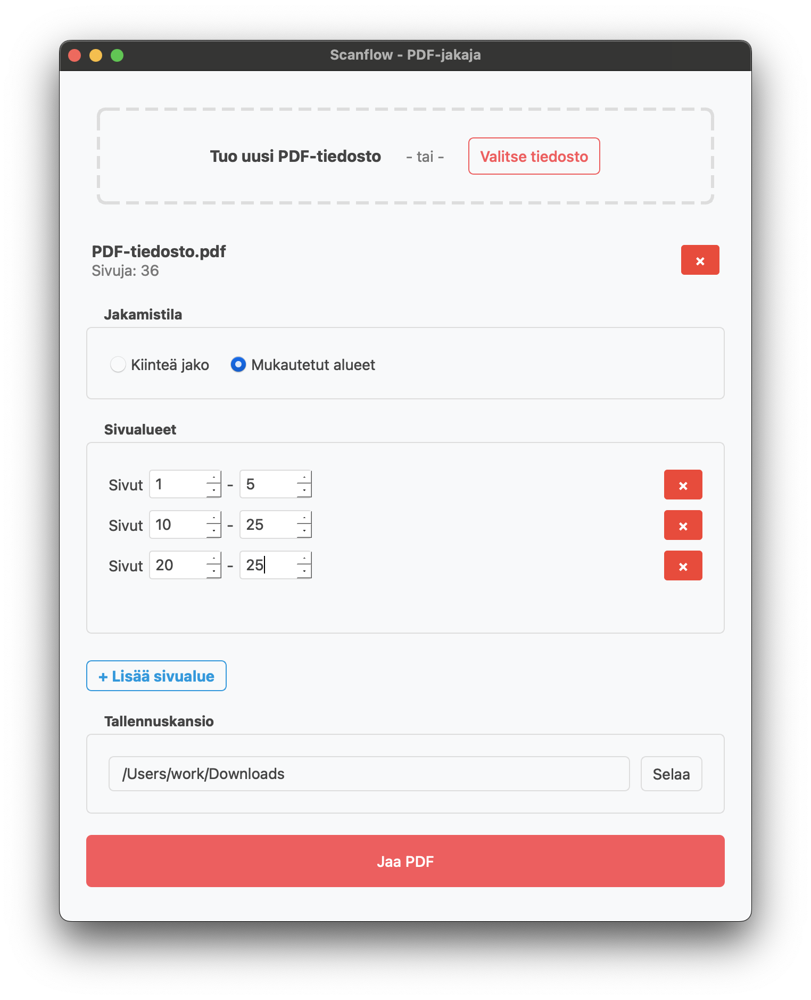
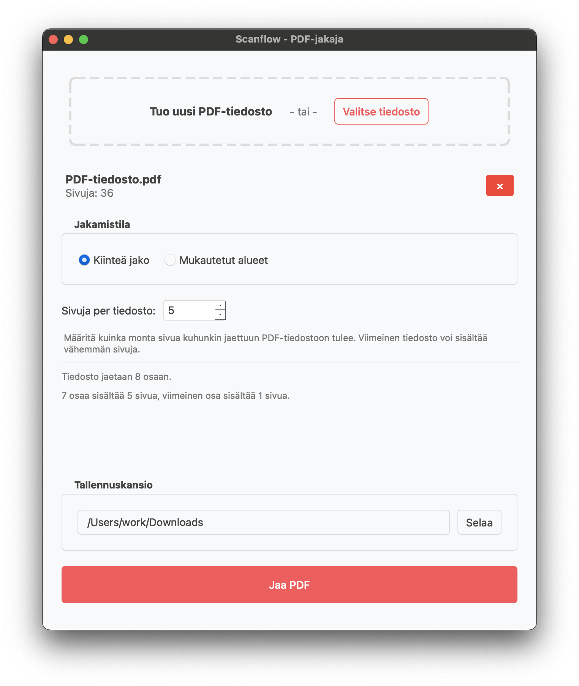

# Sovelluksen käyttöohje

Tämä ohje opastaa sovelluksen asentamisessa ja käytössä vaihe vaiheelta. 


## Sisällys
- [Sovelluksen käynnistäminen](#sovelluksen-käynnistäminen)
- [Käyttöliittymän toiminnot](#käyttöliittymän-toiminnot)
  - [Kiinteä jako](#kiinteä-jako)
  - [Mukautetut alueet](#mukautetut-alueet)
  - [Tallennuskansio](#tallennuskansio)
- [Sovelluksen sulkeminen](#sovelluksen-sulkeminen)
- [Vinkkejä](#vinkkejä)

## Sovelluksen käynnistäminen

1. **Lataa projektin uusin release** GitHubin [Releases-osiosta](https://github.com/gabrot/ot-harjoitustyo/releases/latest) ja valitse **"Source code (zip)"** tai **"Source code (tar.gz)"**.

2. **Pura ladattu arkisto** ja siirry hakemistoon, joka sisältää tiedoston `pyproject.toml`.

> 💡 **Huom:** Tämä on projektin juurihakemisto, jossa sijaitsee mm. `pyproject.toml`, `poetry.lock`, `README.md` jne. Älä aja komentoa `poetry install` väärässä alikansiossa kuten `src/`.

3. **Asenna riippuvuudet:**

   ```bash
   poetry install
   ```

4. **Käynnistä sovellus:**

   ```bash
   poetry run invoke start
   ```

---

## Käyttöliittymän toiminnot

Valitse PDF-tiedosto jollakin seuraavista tavoista:
- Raahaamalla tiedosto  "`Veda ja pudota PDF-tiedosto tähän`" alueelle
- Paina `Valitse tiedosto` -painiketta



Tiedoston lataamisen jälkeen voit valita jommankumman jakotavan:

| Jakotapa              | Kuvaus                                      |
|-----------------------|----------------------------------------------|
| Kiinteä jako          | Jaetaan tiedosto tasavälisiin osiin         |
| Mukautetut alueet     | Jaetaan tiedosto käyttäjän määrittelemiin sivualueisiin |

---

### Kiinteä jako
Tämä vaihtoehto jakaa PDF-tiedoston tasavälisinä osiin syöttämäso sivumäärän perusteella.



1. Syötä haluttu sivumäärä (esim. `5`)
2. Paina `Jaa PDF`
3. Tiedostot tallennetaan `Tallennuskansio`-kohdassa määriteltyyn kansioon 

---

### Mukautetut alueet

Määrittele haluamasi sivualueet muodossa `1-5, 10-25, 20-35`.



1. Syötä alueet tekstikenttään
2. Paina `Jaa PDF`
3. Jokainen alue tallennetaan omaksi PDF-tiedostoksi


> **Vinkki:** Voit käyttää `Mukautetet alueet` toimintoa myös tiedostojen monistamiseen. 
---

### Tallennuskansio

Voit valita kansion, johon jaetut tiedostot tallennetaan. Ellei kansiota valita, käytetään oletussijaintia.

## Sovelluksen sulkeminen

Sovelluksen voi sulkea:
- Ikkunan sulkupainikkeella
- Käyttöjärjestelmän normaalilla sulkemistoiminnolla

## Vinkkejä

- Varmista, että PDF-tiedosto on valittu ennen jakamista
- Sivumäärä tai alueet tulee syöttää oikeassa muodossa
- Mikäli mitään ei tapahdu, tarkista virheilmoitukset ja syötteet
