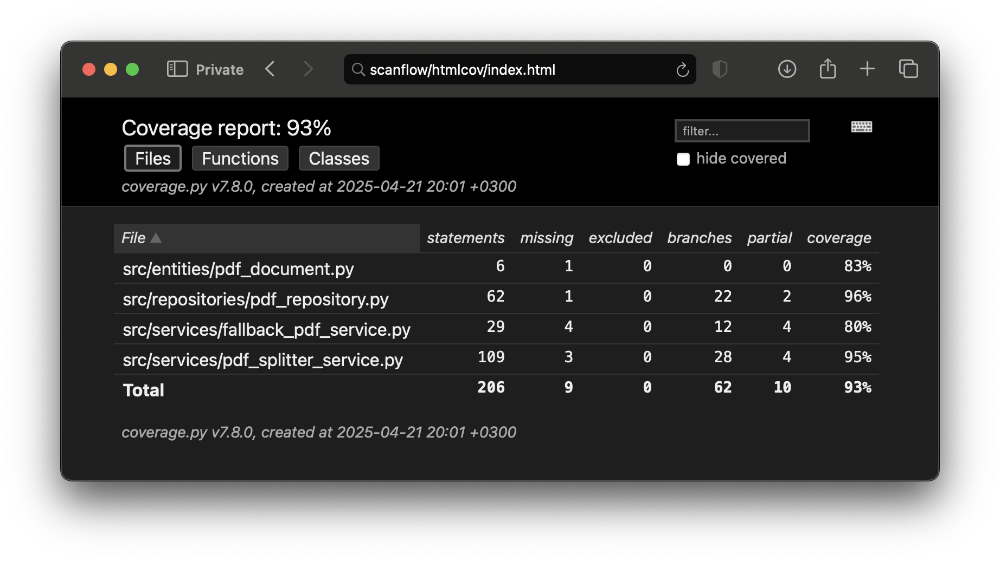

# Testausdokumentti

## Testausympäristö
- **Käyttöjärjestelmät:**  
  - Cubbli Linux
  - macOS Sonoma
- **Python-versiot:** 
  - 3.13.2
  - 3.10.12  
- **Testauskehykset ja -työkalut:**  
  - `pytest`  
  - `unittest` 
  - `coverage.py` 

## Testausmenetelmät

### 1. Yksikkötestaus

Yksikkötestit kattavat kaikki sovelluksen ydintoiminnallisuudet. Testit on sijoitettu `src/tests/`-hakemistoon.

### 2. Testikattavuus

Sovelluksen testauksen haarautumakattavuus (ilman käyttöliittymää) on **93 %**. Raportti generoitiin komennolla:

    poetry run invoke coverage-report

HTML-raportti `htmlcov/index.html` näyttää kattavuuden tiedosto-, luokka- ja haaratasolla.

UI-moduulit (`src/ui/`) on jätetty raportin ulkopuolelle `.coveragerc`-tiedoston avulla.



### 3. Raportointi

- HTML: `htmlcov/index.html`
- JSON: `coverage.json`

---

## Testitulokset

- Testejä ajettiin yhteensä: **48**
- Kaikki testit läpäistiin: ✔ `48 passed`
- Ei virhettä aiheuttavia varoituksia

---

## Järjestelmätestaus

### Asennus ja konfigurointi

Sovellus testattiin alusta asti kahdessa käyttöjärjestelmässä seuraavasti:

1. **macOS (Sonoma)**
   - Poetry-asennus ja riippuvuuksien nouto (`poetry install`)
   - Sovelluksen käynnistys (`poetry run invoke start`)
   - Tiedostojen valinta Finderista sekä drag & drop -tuki


2. **Cubbli Linux (VDI)**
   - Asennus kuten edellä
   - Testattu GNOME/XRDP -ympäristössä
   - Tiedostopolut, kansiovalitsimet ja jaetut levyosiot toimivat
   - Drag & drop ja "Valitse tiedosto" -painike toimivat hyvin VDI-ympäristössä

### Toiminnallisuudet

Testattiin seuraavat toiminnot ja virheenkäsittelytapaukset käsin:

#### ✅ Perustoiminnot
- PDF-tiedoston jako erilaisilla kiinteillä jaoilla 
- PDF-tiedoston jako eri mukautetuilla alueilla
- Tallennuskansion valinta graafisella valitsimella
- Tallennus sijainnin valinta ennen ja jälkeen tiedoston lisäämistä
- Jaettujen tiedostojen tarkistus

[Käyttöohjeessa](kayttoohje.md#käyttöliittymän-toiminnot) mainitut toiminnot testattu ja todettu toimiviksi.

#### Robustisuustestaus 

Alla olevien lomentojen ja tiedostojen avulla testattiin virheellisten PDF-tiedostojen käsittely:

```bash
touch empty.pdf
echo "Tämä ei ole PDF" > fake.pdf
head -c 10000 /System/.../Arial.ttf > broken.pdf
curl -o normal.pdf https://www.adobe.com/support/products/enterprise/knowledgecenter/media/c4611_sample_explain.pdf
head -c 1000 normal.pdf > corrupt-truncated.pdf
mv fake.pdf fake.txt.pdf
```

Kaikissa tapauksissa:
- Sovellus **ei kaatunut**
- Virhetilanteista annettiin **käyttöliittymäilmoitus**
- **Korruptoituneet tiedostot hylättiin** jakovaiheessa

---

## Sovellukseen jääneet laatuongelmat

- **Pitkät tiedostonimet**: GUI ei rivity tai katkaise tekstiä → käyttöliittymä saattaa venyä
- **macOS GUI-varoitukset**: Qt/IMK-tyyppisiä ei-haitallisia konsoliviestejä

---

## Yhteenveto

Testaus kattaa sekä yksikkö- että järjestelmätason testauksen. Sovellus toimii vakaasti erilaisissa ympäristöissä ja virhetilanteet on käsitelty. Testikattavuus on erinomainen ja käyttöliittymä on manuaalisesti läpikäyty kattavasti.